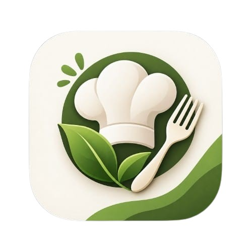
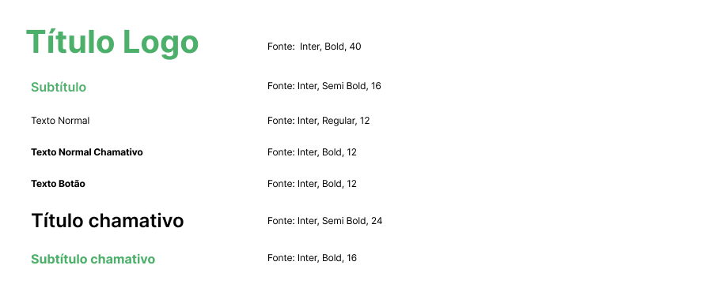
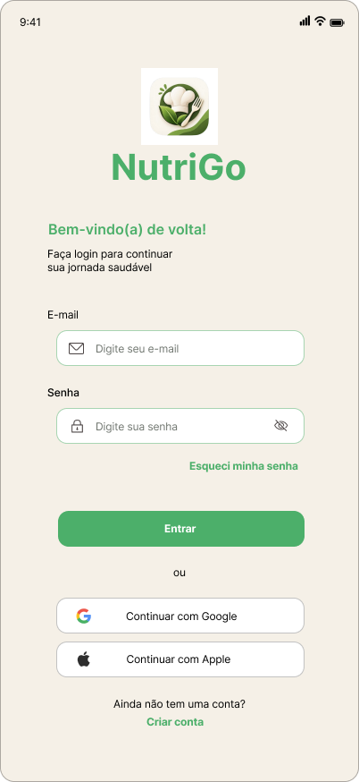
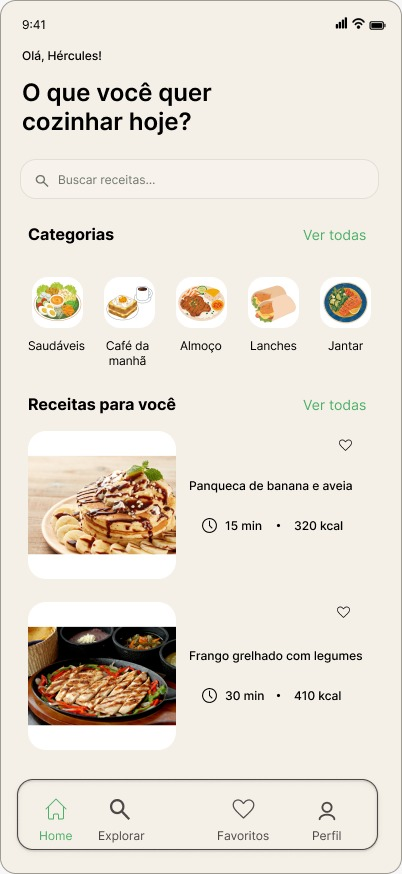
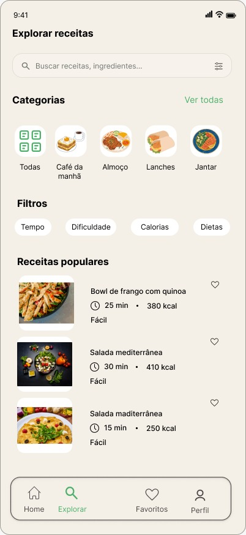
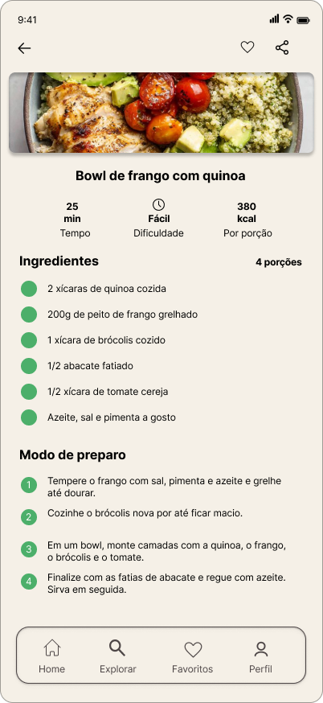
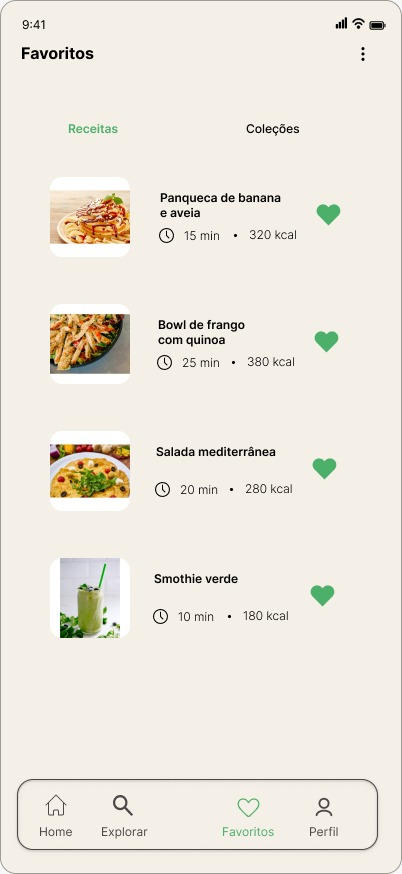
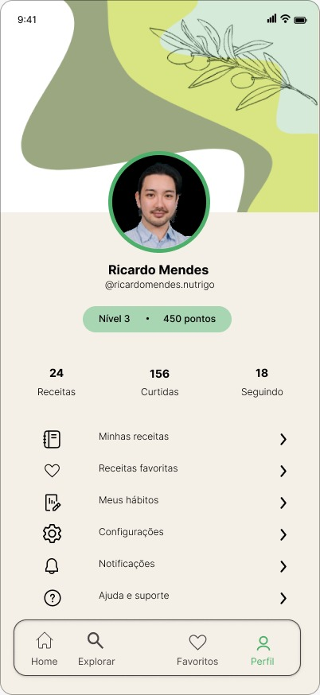

## 👥 Integrantes e responsabilidades

| Integrante | RM | Responsabilidades |
| ---------- | -- | ----------------------- |
| Bruno Anselmo da Silva | RM 566521 | Desenvolvimento de marca, modelo de negócio e pitch |
| Fernando de Almeida Godoi Martines | RM 564820 | Identidade visual, tipografia, paleta de cores e padronização das interfaces |
| Gabriel Ber Soares Tarone | RM 563520 | Documentação, README e organização da entrega |
| Guilherme de Freitas Salgado | RM 562494 | Criação e organização das imagens, materiais visuais e estrutura |
| Vinicius Ribeiro Dias | RM 566468 | Desenvolvimento da interface inicial, componentes e execução do projeto Flutter |

---

# NutriGo 🥗

O NutriGo é um aplicativo voltado para pessoas que desejam melhorar sua alimentação de forma simples, prática e social. A plataforma combina **compartilhamento de receitas, descoberta de novas opções alimentares e acompanhamento de hábitos**, criando um ambiente em que os usuários podem aprender, experimentar e evoluir juntos.

---

### Sobre o projeto - Problema

Manter uma alimentação equilibrada pode ser difícil. Muitas pessoas têm vontade de melhorar seus hábitos alimentares, mas encontram obstáculos como falta de ideias para refeições, dificuldade em manter uma rotina, excesso de informações conflitantes e pouca motivação para continuar.

O NutriGo busca resolver esse problema ao transformar a alimentação saudável em uma experiência mais **acessível, personalizada e colaborativa**.

Em vez de apenas oferecer informações sobre dieta, o aplicativo cria uma comunidade na qual os usuários podem compartilhar receitas, descobrir novas refeições e acompanhar seus próprios hábitos.

### Público-alvo

O aplicativo é destinado principalmente a:

- Pessoas que desejam melhorar seus hábitos alimentares;
- Usuários que procuram receitas práticas e variadas;
- Pessoas que desejam organizar melhor sua alimentação;
- Usuários interessados em dietas e diferentes estilos alimentares;
- Pessoas que encontram motivação por meio de comunidades e compartilhamento de experiências.

---

# Principais funcionalidades

A primeira versão do aplicativo terá como foco as funcionalidades essenciais para validar a proposta do produto.

### 👤 Usuários

- Cadastro e login;
- Perfil do usuário;
- Edição de informações básicas;
- Visualização das receitas publicadas pelo próprio usuário.

### 🍳 Receitas

- Criar e publicar receitas;
- Adicionar nome, descrição, ingredientes e modo de preparo;
- Adicionar imagem da receita;
- Visualizar receitas publicadas por outros usuários;

### ❤️ Interação social

- Curtir receitas;
- Salvar receitas favoritas;
- Compartilhar receitas;
- Visualizar receitas de outros usuários.

### 📊 Hábitos alimentares

- Registrar hábitos relacionados à alimentação;
- Acompanhar a frequência desses hábitos;
- Visualizar evolução ao longo do tempo.

### 🔎 Descoberta

- Feed de receitas;
- Recomendações baseadas nos interesses do usuário;
- Categorias e filtros alimentares.

---

#  Desenvolvimento de marca

## Nome: NutriGo

O nome NutriGo combina duas ideias centrais do aplicativo:

**Nutri** → representa nutrição, alimentação e hábitos alimentares.

**Go** → representa determinação, iniciativa e a vontade de começar.

A combinação reforça a proposta de que **melhorar a alimentação pode ser uma experiência coletiva**, na qual as pessoas compartilham receitas, conhecimentos e descobertas.

### Naming rationale

O nome foi escolhido por ser:

- Fácil de lembrar;
- Relacionado diretamente ao propósito do aplicativo;
- Associado aos conceitos de alimentação e iniciativa;

###  Tom de voz

A comunicação da marca deve ser:

**Amigável**
O aplicativo deve conversar com o usuário de forma próxima e acessível.

**Positiva**
O foco deve estar em incentivar melhorias e conquistas, evitando uma comunicação baseada em culpa.

**Motivadora**
A linguagem deve estimular pequenas mudanças consistentes.

**Inclusiva**
O produto deve respeitar diferentes estilos de alimentação, objetivos e realidades.

**Simples**
Informações e funcionalidades devem ser apresentadas de maneira clara, evitando excesso de termos técnicos.

---

#  Identidade visual

A identidade visual do NutriGo deve transmitir **saúde, naturalidade, leveza e comunidade**.

## 🖼️ Logo



O conceito do logo pode combinar elementos relacionados a:

- Alimentação;
- Compartilhamento;
- Comunidade;
- Bem-estar.

## 🎨 Paleta de cores 

| Cor             | Hexadecimal | Aplicação                             |
| --------------- | ----------- | ------------------------------------- |
| Verde principal | `#4CAF6A`   | Ações principais e identidade         |
| Verde claro     | `#A8D5B2`   | Elementos secundários                 |
| Creme           | `#F5EFE4`   | Fundos                                |
| Bege            | `#E8DCC2`   | Fundos secundários e detalhes visuais |
| Cinza escuro    | `#333333`   | Textos                                |
| Cinza grafite   | `#4E4747`   | Ícones e texto de ícones              |
| Branco          | `#FFFFFF`   | Fundos e contraste                    |

A combinação busca transmitir **saúde e naturalidade** por meio dos tons verdes, enquanto o creme e beje adiciona simplicidade e destaque às interações.

## 🔤 Tipografia

A identidade tipográfica do NutriGo utiliza a fonte **Inter** como fonte principal da interface.

A escolha da fonte busca garantir boa legibilidade em dispositivos móveis, além de proporcionar uma aparência moderna, limpa e consistente em todas as telas do aplicativo.

### Hierarquia tipográfica

<p align="center">
  
</p>

| Estilo | Fonte | Peso | Tamanho |
| ------ | ----- | ---- | ------- |
| Título Logo | Inter | Bold | 40px |
| Subtítulo | Inter | Semi Bold | 16px |
| Texto Normal | Inter | Regular | 12px |
| Texto Normal Chamativo | Inter | Bold | 12px |
| Texto Botão | Inter | Bold | 12px |
| Título Chamativo | Inter | Semi Bold | 24px |
| Subtítulo Chamativo | Inter | Bold | 16px |

### Aplicação da tipografia

A hierarquia tipográfica é utilizada para manter consistência visual entre as diferentes telas do aplicativo:

- **Título Logo:** utilizado para destacar o nome e a identidade do aplicativo;
- **Subtítulo:** utilizado em informações secundárias e seções da interface;
- **Texto Normal:** utilizado em descrições, informações e conteúdos gerais;
- **Texto Normal Chamativo:** utilizado quando uma informação textual precisa de maior destaque;
- **Texto Botão:** utilizado nos botões e ações da interface;
- **Título Chamativo:** utilizado nos principais títulos das telas e conteúdos;
- **Subtítulo Chamativo:** utilizado para destacar seções e informações importantes.

---

## 📱 Interface

As telas do NutriGo seguem a identidade visual definida para o projeto, utilizando a paleta de cores, tipografia e elementos visuais de forma consistente.

<table>
  <tr>
    <td align="center">
      <strong>Login</strong><br><br>
      
    </td>
    <td align="center">
      <strong>Home</strong><br><br>
      
    </td>
    <td align="center">
      <strong>Explorar Receitas</strong><br><br>
      
    </td>
  </tr>
  <tr>
    <td align="center">
      <strong>Detalhes da Receita</strong><br><br>
      
    </td>
    <td align="center">
      <strong>Favoritos</strong><br><br>
      
    </td>
    <td align="center">
      <strong>Perfil</strong><br><br>
      
    </td>
  </tr>
</table>

---

# 💡 Ideia de venda — Pitch

### O problema

Milhões de pessoas desejam se alimentar melhor, mas encontram dificuldades para transformar esse objetivo em uma rotina sustentável.

Aplicativos tradicionais frequentemente focam apenas em **calorias, dietas ou acompanhamento individual**, deixando de lado um fator importante: **motivação e troca de experiências**.

### A solução

O NutriGo transforma a alimentação em uma experiência **social e participativa**.

O usuário pode descobrir receitas, compartilhar suas próprias criações, acompanhar hábitos e encontrar inspiração em uma comunidade com objetivos semelhantes.

### Diferencial competitivo

O principal diferencial do NutriGo é combinar:

**Receitas + comunidade + hábitos alimentares**

Em vez de tratar alimentação apenas como um conjunto de números ou restrições, o aplicativo busca criar uma experiência mais positiva e sustentável.

###  Modelo de negócio

O modelo de negócio poderá combinar diferentes fontes de receita:

**Freemium**

A maioria das funcionalidades será disponibilizada gratuitamente, enquanto recursos avançados específicos poderão fazer parte de um plano premium.

**Plano Premium**

Possíveis funcionalidades:

- Recomendações personalizadas;
- Análises avançadas de hábitos;
- Cardápios e planejamento de refeições futuras;
- Recursos adicionais para organização alimentar.

**Parcerias**

O aplicativo também poderá estabelecer parcerias com:

- Marcas de alimentos;
- Mercados;
- Empresas de produtos naturais;
- Profissionais e serviços relacionados à alimentação;
- Plataformas de entrega.

### 🎤 Pitch

> “O NutriGo é uma plataforma social para pessoas que querem melhorar sua alimentação sem transformar esse processo em uma obrigação. Combinamos compartilhamento de receitas, descoberta de novos pratos e acompanhamento de hábitos em uma única experiência, permitindo que os usuários aprendam, compartilhem e evoluam juntos.”

---

# 📁 Estrutura do projeto

A estrutura será definida conforme o desenvolvimento do aplicativo avançar.

```text
NutriGo/
├── README.md
├── docs/
├── frontend/
├── backend/
├── data/
└── tests/
```

---