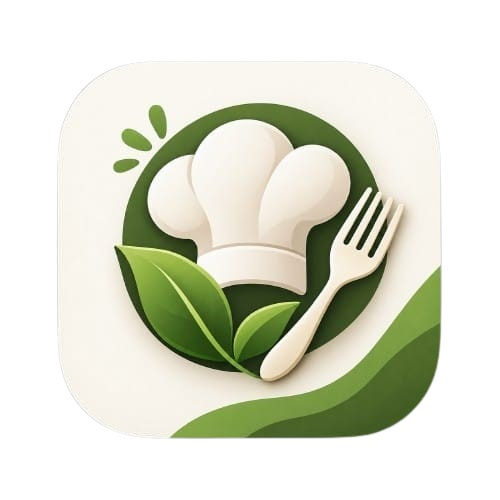
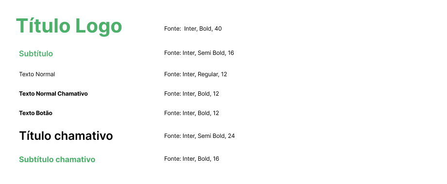
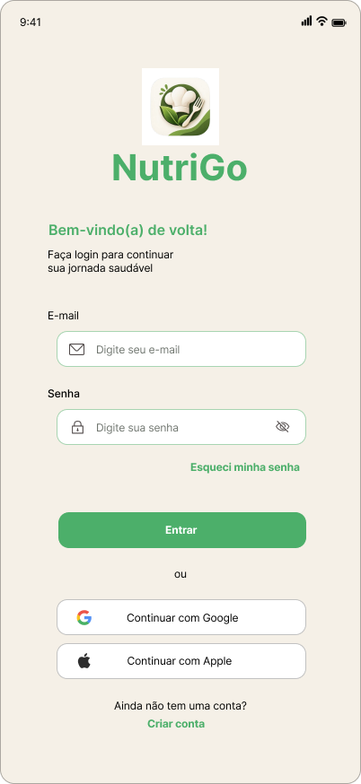
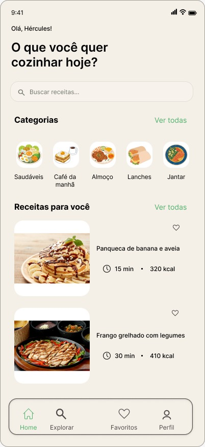
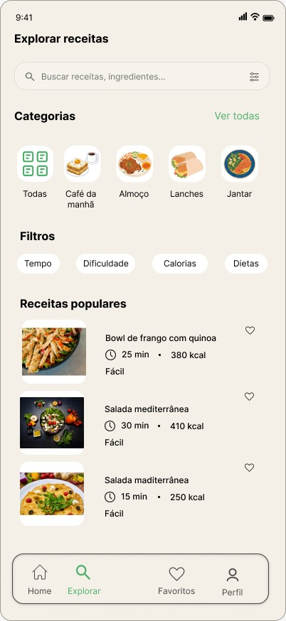
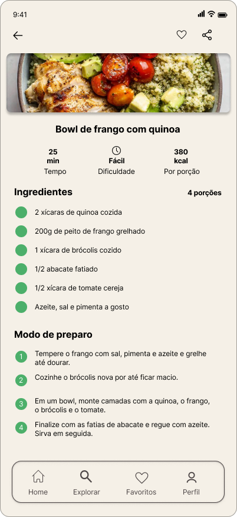
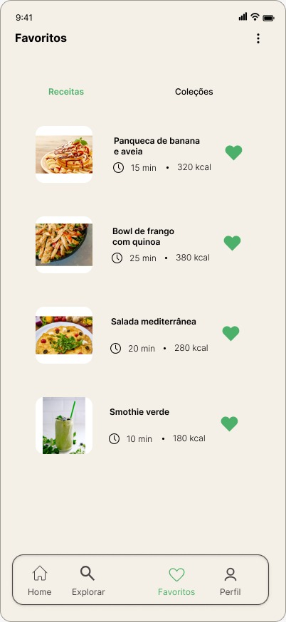
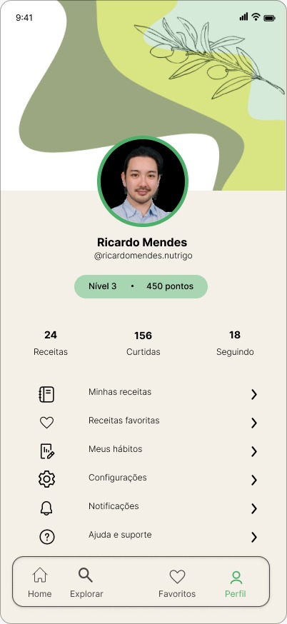

## 👥 Integrantes e responsabilidades

| Integrante | RM | Responsabilidades |
| ---------- | -- | ----------------- |
| Bruno Anselmo da Silva | RM 566521 | Desenvolvimento de marca, modelo de negócio e pitch |
| Fernando de Almeida Godoi Martines | RM 564820 | Identidade visual, tipografia, paleta de cores e padronização das interfaces |
| Gabriel Ber Soares Tarone | RM 563520 | Documentação, README e organização da entrega |
| Guilherme de Freitas Salgado | RM 562494 | Criação e organização das imagens, materiais visuais e estrutura |
| Vinicius Ribeiro Dias | RM 566468 | Desenvolvimento da interface inicial, componentes e execução do projeto Flutter |

---

# NutriGo 🥗

O **NutriGo** é um aplicativo desenvolvido em Flutter voltado para pessoas que desejam melhorar sua alimentação de forma simples, prática e social.

A plataforma combina **descoberta e compartilhamento de receitas, organização de favoritos e acompanhamento do usuário**, criando uma experiência em que as pessoas podem encontrar inspiração para suas refeições e compartilhar suas próprias receitas.

---

# 📌 Sobre o projeto

## Problema

Manter uma alimentação equilibrada pode ser difícil. Muitas pessoas têm vontade de melhorar seus hábitos alimentares, mas encontram obstáculos como falta de ideias para refeições, dificuldade em manter uma rotina, excesso de informações conflitantes e pouca motivação para continuar.

O **NutriGo** busca tornar esse processo mais acessível ao reunir receitas, organização e interação em uma única aplicação.

Em vez de apenas oferecer informações sobre dieta, o aplicativo busca criar uma experiência na qual os usuários possam descobrir receitas, publicar suas próprias opções, organizar seus favoritos e encontrar inspiração para suas refeições.

---

# 🎯 Público-alvo

O aplicativo é destinado principalmente a:

- Pessoas que desejam melhorar seus hábitos alimentares;
- Usuários que procuram receitas práticas e variadas;
- Pessoas que desejam organizar melhor sua alimentação;
- Usuários interessados em diferentes estilos alimentares;
- Pessoas que encontram motivação por meio do compartilhamento de experiências.

---

# 🚀 Status atual do projeto

O NutriGo encontra-se em desenvolvimento como aplicativo **Flutter/Dart**, com integração ao **Supabase** para autenticação, gerenciamento de usuários, persistência de receitas, armazenamento de imagens e favoritos.

O projeto já possui as seguintes funcionalidades implementadas:

- **Autenticação:** cadastro, login e gerenciamento de sessão por meio do Supabase Auth.
- **Perfis:** armazenamento das informações dos usuários no PostgreSQL.
- **Receitas:** cadastro, consulta, edição e exclusão de receitas, com persistência no Supabase.
- **Imagens:** envio, substituição e exclusão de fotografias utilizando Supabase Storage.
- **Favoritos:** adição e remoção de receitas favoritas, com persistência por usuário no banco de dados.
- **Segurança:** utilização de políticas Row Level Security (RLS) para controlar o acesso aos dados e arquivos.
- **Navegação:** integração entre Home, Explorar Receitas, Favoritos, Perfil e telas de gerenciamento de receitas.

O aplicativo combina receitas demonstrativas com receitas cadastradas no banco de dados.

As funcionalidades de persistência de receitas, gerenciamento de imagens e favoritos foram implementadas e testadas.

O projeto continua em evolução, com melhorias e funcionalidades adicionais previstas para as próximas etapas.


---

# ✨ Funcionalidades implementadas

## 👤 Autenticação e usuários

- Cadastro de novos usuários;
- Login com e-mail e senha;
- Autenticação utilizando Supabase Auth;
- Validação dos campos de cadastro e login;
- Armazenamento do perfil do usuário;
- Identificação do usuário autenticado;
- Exibição dinâmica do nome do usuário na Home;
- Estrutura preparada para gerenciamento de sessão.

## 🍳 Receitas

O NutriGo permite consultar e gerenciar receitas, utilizando o **Supabase PostgreSQL** para armazenar as receitas publicadas.

Funcionalidades implementadas:

- Visualização de receitas demonstrativas e receitas cadastradas no Supabase;
- Tela de detalhes das receitas;
- Busca por nome e categoria;
- Filtros por categorias;
- Publicação de novas receitas;
- Cadastro de ingredientes e modo de preparo;
- Informações de tempo, dificuldade, calorias e categorias alimentares;
- Visualização das receitas publicadas pelo próprio usuário;
- Edição de receitas existentes;
- Exclusão de receitas publicadas pelo usuário;
- Persistência das receitas na tabela `recipes`;
- Associação das receitas aos usuários autenticados por meio de identificadores UUID.

### 📷 Imagens das receitas

As imagens são gerenciadas utilizando o **Supabase Storage**, no bucket `receitas`.

O aplicativo permite:

- Selecionar imagens da galeria;
- Enviar imagens JPG, PNG e WebP, com limite de 5 MB;
- Armazenar as imagens em pastas associadas ao usuário autenticado;
- Exibir as imagens armazenadas no Supabase;
- Substituir imagens durante a edição de receitas;
- Excluir imagens vinculadas a receitas removidas;
- Remover imagens antigas após a substituição, evitando arquivos desnecessários.

As operações de armazenamento utilizam políticas de segurança para restringir as alterações aos arquivos pertencentes ao usuário autenticado.

## ❤️ Favoritos

O NutriGo possui um sistema de favoritos com **persistência no Supabase**, permitindo que cada usuário mantenha suas receitas favoritas mesmo após fechar e abrir novamente o aplicativo.

Funcionalidades implementadas:

- Adicionar receitas aos favoritos;
- Remover receitas dos favoritos;
- Salvar favoritos na tabela `favorites`;
- Associar favoritos ao usuário autenticado;
- Recuperar automaticamente os favoritos ao carregar o aplicativo;
- Favoritar receitas demonstrativas e receitas cadastradas no Supabase;
- Sincronizar a exibição dos favoritos entre Home, Explorar, Favoritos e Perfil;
- Exibir receitas favoritas em uma tela dedicada.

A tabela `favorites` utiliza `recipe_id` para receitas persistidas no banco e `demo_recipe_key` para identificar receitas demonstrativas.

As políticas RLS restringem a consulta, a inclusão e a remoção dos registros de favoritos ao usuário correspondente.

## 🧭 Navegação

O aplicativo possui navegação entre as principais áreas:

- Home;
- Receitas;
- Favoritos;
- Perfil;
- Detalhes da receita;
- Publicação de receita;
- Configurações.

---

# 🛠️ Tecnologias utilizadas

O projeto utiliza as seguintes tecnologias:

- **Flutter**
- **Dart**
- **Supabase**
- **PostgreSQL**
- **Supabase Auth**
- **Row Level Security (RLS)**
- **flutter_dotenv**
- **supabase_flutter**
- **image_picker**

O desenvolvimento é realizado utilizando o **Visual Studio Code**.

---

# 🗄️ Banco de dados e autenticação

O projeto utiliza o **Supabase** como solução de backend em nuvem.

Atualmente, a integração contempla autenticação, gerenciamento de perfis, persistência de receitas e favoritos no PostgreSQL, além do armazenamento de imagens no Supabase Storage.

## Autenticação

O cadastro é realizado utilizando o **Supabase Auth**.

Cada usuário possui um identificador único (`UUID`) gerado pelo sistema de autenticação.

Fluxo atual:

```text
Cadastro
   ↓
Supabase Auth
   ↓
auth.users
   ↓
Trigger do banco
   ↓
profiles
```

Após a criação do usuário, um trigger do PostgreSQL cria automaticamente o perfil correspondente na tabela `profiles`.

---

## Tabela `profiles`

A tabela `profiles` armazena informações complementares do usuário.

Estrutura utilizada:

```text
profiles
├── id
├── nome
└── created_at
```

O campo `id` possui relação com o usuário criado pelo Supabase Auth.

---

## 🔐 Row Level Security

A tabela `profiles` utiliza **Row Level Security (RLS)**.

As políticas implementadas garantem que um usuário autenticado possa:

- visualizar seu próprio perfil;
- criar seu próprio perfil;
- atualizar seu próprio perfil.

Dessa forma, os dados de cada perfil são associados ao usuário autenticado.

---

## 🍳 Tabela `recipes`

A tabela `recipes` armazena as receitas publicadas pelos usuários do NutriGo.

Cada receita possui um identificador único (`UUID`) e está associada ao usuário responsável pela publicação.

Entre os dados armazenados estão:

- Identificador da receita (`id`);
- Identificador do usuário (`user_id`);
- Nome da receita;
- Categoria;
- Tempo de preparo;
- Dificuldade;
- Calorias;
- Ingredientes;
- Modo de preparo;
- Categorias alimentares;
- Caminho da imagem armazenada no Supabase Storage.

### Operações implementadas

O aplicativo realiza as operações CRUD:

- **CREATE:** publicação de novas receitas;
- **READ:** consulta das receitas cadastradas;
- **UPDATE:** edição das receitas pertencentes ao usuário;
- **DELETE:** exclusão das receitas pertencentes ao usuário.

A aplicação utiliza o serviço `SupabaseRecipeService` para realizar essas operações.

### Segurança das receitas

As políticas de Row Level Security (RLS) permitem a consulta de receitas conforme as regras configuradas e restringem as operações de criação, edição e exclusão aos usuários autorizados.

---

## ❤️ Tabela `favorites`

A tabela `favorites` armazena os favoritos de cada usuário autenticado.

Estrutura principal:

```text
favorites
├── id
├── user_id
├── recipe_id
├── demo_recipe_key
└── created_at
```

Os campos possuem as seguintes responsabilidades:

- `id`: identificador único do favorito;
- `user_id`: identifica o usuário responsável;
- `recipe_id`: identifica uma receita cadastrada no Supabase;
- `demo_recipe_key`: identifica uma receita demonstrativa;
- `created_at`: registra a data de criação do favorito.

Uma restrição garante que cada registro utilize `recipe_id` ou `demo_recipe_key`, mas não ambos.

Também existem restrições para evitar que o mesmo usuário cadastre o mesmo favorito mais de uma vez.

### Segurança dos favoritos

A tabela utiliza políticas RLS para permitir que usuários autenticados:

- Consultem seus próprios favoritos;
- Adicionem favoritos associados à própria conta;
- Removam seus próprios favoritos.

O gerenciamento é realizado pelo serviço `SupabaseFavoriteService`.

Os favoritos são recuperados quando o aplicativo carrega as receitas, permitindo sua persistência entre sessões.

---

## 📷 Supabase Storage

O NutriGo utiliza o **Supabase Storage** para armazenar as imagens das receitas.

O bucket utilizado é:

```text
receitas
```

Os arquivos são organizados em pastas identificadas pelo UUID do usuário autenticado.

Exemplo ilustrativo:

```text
receitas/
└── UUID_DO_USUARIO/
    ├── imagem_1.jpg
    └── imagem_2.png
```

O aplicativo permite:

- Upload de imagens JPG, PNG e WebP;
- Limite de 5 MB por imagem;
- Exibição das imagens armazenadas;
- Substituição de imagens durante a edição;
- Exclusão das imagens associadas às receitas removidas;
- Limpeza da imagem anterior após uma substituição bem-sucedida.

### Segurança do armazenamento

O bucket utiliza políticas de acesso para operações de:

- `SELECT`;
- `INSERT`;
- `UPDATE`;
- `DELETE`.

As operações de alteração são restringidas aos arquivos localizados nas pastas pertencentes ao usuário autenticado.

O serviço `SupabaseStorageService` centraliza as operações de armazenamento e exclusão de imagens.

---

# 🧱 Arquitetura

O projeto utiliza uma separação entre **interface**, **regras de acesso aos dados** e **implementações dos serviços**.

As telas não precisam conhecer diretamente os detalhes de comunicação com o banco.

Exemplo:

```text
HomePage
   ↓
ProfileService
   ↓
SupabaseProfileService
   ↓
Supabase
   ↓
profiles
```

Para autenticação:

```text
LoginPage / CadastroPage
          ↓
      AuthService
          ↓
SupabaseAuthService
          ↓
    Supabase Auth
```

Essa estrutura facilita a manutenção e permite substituir ou evoluir a camada de persistência sem concentrar a lógica de banco de dados nas telas.

---

# 📁 Estrutura do projeto

A aplicação Flutter está organizada principalmente da seguinte forma:

```text
lib/
├── core/
│   ├── theme/
│   └── widgets/
│
├── models/
│   ├── recipe.dart
│   └── recipe_data.dart
│
├── screens/
│   ├── cadastro/
│   ├── configuracoes/
│   ├── detalhes_receita/
│   ├── favoritos/
│   ├── home/
│   ├── login/
│   ├── main/
│   ├── perfil/
│   ├── receitas/
│   └── ...
│
├── services/
│   ├── auth_service.dart
│   ├── profile_service.dart
│   │
│   └── supabase/
│       ├── supabase_auth_service.dart
│       ├── supabase_profile_service.dart
│       ├── supabase_recipe_service.dart
│       ├── supabase_storage_service.dart
│       └── supabase_favorite_service.dart
│
├── env.dart
└── main.dart
```

A estrutura continuará sendo expandida conforme novas funcionalidades e integrações forem adicionadas.

---

# 🔑 Variáveis de ambiente

As credenciais públicas necessárias para conexão com o Supabase são carregadas por meio de variáveis de ambiente.

O projeto contém o arquivo:

```text
.env.example
```

Exemplo:

```env
SUPABASE_URL=
SUPABASE_ANON_KEY=
```

Por segurança, o arquivo `.env` real **não é versionado no GitHub** e está incluído no `.gitignore`.

> Nunca devem ser adicionadas ao aplicativo chaves administrativas, `service_role` ou outras credenciais secretas do Supabase.

---

# ▶️ Como executar o projeto

## Pré-requisitos

É necessário possuir:

- Flutter SDK instalado;
- Dart;
- Visual Studio Code ou outra IDE compatível;
- Git.

Verifique a instalação do Flutter:

```bash
flutter doctor
```

---

## 1. Clone o repositório

```bash
git clone https://github.com/GabrielTarone/app-dieta.git
```

Entre na pasta do projeto Flutter:

```bash
cd app-dieta
```

---

## 2. Instale as dependências

Execute:

```bash
flutter pub get
```

---

## 3. Configure o Supabase

Crie um arquivo chamado:

```text
.env
```

na raiz do projeto Flutter.

Utilize `.env.example` como referência:

```env
SUPABASE_URL=SUA_URL_DO_SUPABASE
SUPABASE_ANON_KEY=SUA_CHAVE_PUBLICAVEL
```

O arquivo `.env` não deve ser enviado ao GitHub.

---

## 4. Execute o projeto

Para verificar os dispositivos disponíveis:

```bash
flutter devices
```

Para executar no Chrome:

```bash
flutter run -d chrome
```

Também é possível executar em outros dispositivos compatíveis configurados no ambiente Flutter.

---

## 5. Verifique o código

Antes de executar ou enviar alterações ao repositório, recomenda-se utilizar:

```bash
flutter analyze
```

O comando verifica problemas e avisos no código Dart/Flutter.

---

# 🖼️ Identidade visual

A identidade visual do NutriGo busca transmitir:

- Saúde;
- Naturalidade;
- Leveza;
- Simplicidade;
- Comunidade.

## Logo

<p align="center">
  
</p>

---

## 🎨 Paleta de cores

| Cor | Hexadecimal | Aplicação |
| --- | --- | --- |
| Verde principal | `#4CAF6A` | Ações principais e identidade |
| Verde claro | `#A8D5B2` | Elementos secundários |
| Creme | `#F5EFE4` | Fundos |
| Bege | `#E8DCC2` | Fundos secundários e detalhes visuais |
| Cinza escuro | `#333333` | Textos |
| Cinza grafite | `#4E4747` | Ícones e texto de ícones |
| Branco | `#FFFFFF` | Fundos e contraste |

A combinação busca transmitir **saúde e naturalidade** por meio dos tons verdes, enquanto os tons neutros ajudam a manter uma interface leve e organizada.

---

# 🔤 Tipografia

A identidade tipográfica do NutriGo utiliza a fonte **Inter** como fonte principal da interface.

A escolha busca garantir boa legibilidade em dispositivos móveis e proporcionar uma aparência moderna, limpa e consistente.

<p align="center">
  
</p>

| Estilo | Fonte | Peso | Tamanho |
| ------ | ----- | ---- | ------- |
| Título Logo | Inter | Bold | 40px |
| Subtítulo | Inter | Semi Bold | 16px |
| Texto Normal | Inter | Regular | 12px |
| Texto Normal Chamativo | Inter | Bold | 12px |
| Texto Botão | Inter | Bold | 12px |
| Título Chamativo | Inter | Semi Bold | 24px |
| Subtítulo Chamativo | Inter | Bold | 16px |

---

# 📱 Interface

As telas do NutriGo seguem a identidade visual definida para o projeto, utilizando a paleta de cores, tipografia e componentes de forma consistente.

<table>
  <tr>
    <td align="center">
      <strong>Login</strong><br><br>
      
    </td>
    <td align="center">
      <strong>Home</strong><br><br>
      
    </td>
    <td align="center">
      <strong>Explorar Receitas</strong><br><br>
      
    </td>
  </tr>
  <tr>
    <td align="center">
      <strong>Detalhes da Receita</strong><br><br>
      
    </td>
    <td align="center">
      <strong>Favoritos</strong><br><br>
      
    </td>
    <td align="center">
      <strong>Perfil</strong><br><br>
      
    </td>
  </tr>
</table>

---

# 💡 Desenvolvimento de marca

## Nome: NutriGo

O nome **NutriGo** combina duas ideias centrais do aplicativo:

**Nutri** → representa nutrição, alimentação e hábitos alimentares.

**Go** → representa determinação, iniciativa e a vontade de começar.

A combinação reforça a proposta de que melhorar a alimentação pode ser uma experiência coletiva, na qual as pessoas compartilham receitas, conhecimentos e descobertas.

### Naming rationale

O nome foi escolhido por ser:

- Fácil de lembrar;
- Relacionado diretamente ao propósito do aplicativo;
- Associado aos conceitos de alimentação e iniciativa.

---

# 🗣️ Tom de voz

A comunicação da marca busca ser:

**Amigável**  
O aplicativo conversa com o usuário de forma próxima e acessível.

**Positiva**  
O foco está em incentivar melhorias e conquistas, evitando uma comunicação baseada em culpa.

**Motivadora**  
A linguagem busca estimular pequenas mudanças consistentes.

**Inclusiva**  
O produto busca respeitar diferentes estilos de alimentação, objetivos e realidades.

**Simples**  
As informações e funcionalidades são apresentadas de maneira clara, evitando excesso de termos técnicos.

---

# 💡 Ideia de venda — Pitch

## O problema

Milhões de pessoas desejam se alimentar melhor, mas encontram dificuldades para transformar esse objetivo em uma rotina sustentável.

Aplicativos tradicionais frequentemente focam apenas em **calorias, dietas ou acompanhamento individual**, deixando de lado um fator importante: **motivação e troca de experiências**.

## A solução

O **NutriGo** transforma a alimentação em uma experiência social e participativa.

O usuário pode descobrir receitas, compartilhar suas próprias criações e encontrar inspiração em uma comunidade com objetivos semelhantes.

## Diferencial competitivo

O principal diferencial proposto pelo NutriGo é combinar:

**Receitas + comunidade + hábitos alimentares**

Em vez de tratar alimentação apenas como um conjunto de números ou restrições, o aplicativo busca criar uma experiência mais positiva e sustentável.

---

# 💰 Modelo de negócio

O modelo de negócio poderá combinar diferentes fontes de receita.

### Freemium

A maioria das funcionalidades poderá ser disponibilizada gratuitamente, enquanto recursos avançados poderão fazer parte de um plano premium.

### Plano Premium

Possíveis funcionalidades futuras:

- Recomendações personalizadas;
- Análises avançadas de hábitos;
- Cardápios;
- Planejamento de refeições;
- Recursos adicionais para organização alimentar.

### Parcerias

O aplicativo também poderá estabelecer parcerias com:

- Marcas de alimentos;
- Mercados;
- Empresas de produtos naturais;
- Profissionais e serviços relacionados à alimentação;
- Plataformas de entrega.

---

# 🎤 Pitch

> “O NutriGo é uma plataforma social para pessoas que querem melhorar sua alimentação sem transformar esse processo em uma obrigação. Combinamos compartilhamento de receitas, descoberta de novos pratos e acompanhamento de hábitos em uma única experiência, permitindo que os usuários aprendam, compartilhem e evoluam juntos.”

---

# 🔄 Próximas etapas

O NutriGo já possui autenticação, gerenciamento de receitas, armazenamento de imagens e favoritos persistentes integrados ao Supabase.

As próximas etapas do desenvolvimento incluem:

### 👤 Usuários e autenticação

- Evoluir as funcionalidades do perfil do usuário;
- Implementar recuperação de senha;
- Aprimorar o gerenciamento de sessão;
- Melhorar as mensagens de validação e tratamento de erros.

### 🍳 Receitas e experiência do usuário

- Aprimorar a busca e os filtros de receitas;
- Melhorar a experiência de publicação e edição;
- Implementar indicadores de carregamento;
- Aprimorar o tratamento de falhas de conexão;
- Refinar a responsividade das interfaces.

### 🧪 Testes e validação

- Realizar testes completos dos fluxos de cadastro e login;
- Validar as operações de receitas com diferentes usuários;
- Testar as políticas de segurança do Supabase;
- Validar o comportamento do aplicativo em diferentes dispositivos;
- Revisar possíveis erros e inconsistências.

### 📱 Preparação da entrega

- Revisar a documentação do projeto;
- Atualizar as imagens das interfaces;
- Gerar e validar o APK Android;
- Realizar os testes finais da aplicação;
- Preparar a versão final para apresentação acadêmica.

---

# 📚 Projeto acadêmico

Projeto desenvolvido para a disciplina de **CPAD**, utilizando Flutter e Dart como tecnologias principais para o desenvolvimento da aplicação.

O projeto evolui de forma incremental, mantendo o repositório atualizado conforme novas funcionalidades são implementadas e testadas.